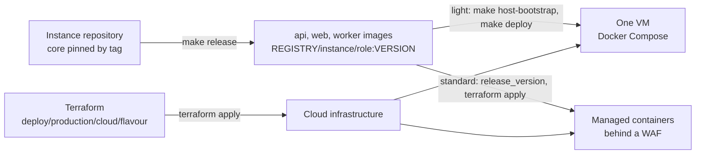

# Production environment

This directory holds the template's default `production` environment and the
Terraform that creates the cloud infrastructure for it.

## 1. Contents

| Path | Function |
|---|---|
| `host.env`, `secrets`, `config/` | The `host` adapter's configuration for `make deploy ENV=production` ([docs/deploy.md](../../docs/deploy.md)). |
| [`azure/`](azure/README.md) | Terraform for Azure: `light` and `standard`. |
| [`aws/`](aws/README.md) | Terraform for AWS: `light` and `standard`. |

## 2. One method per flavour, on both clouds

Each flavour deploys Margince the same way on Azure and on AWS. Only the
cloud services differ.



| | Light: proof of concept, small pilots | Standard: mid-size production |
|---|---|---|
| Deployment | Terraform creates the server; the `host` adapter deploys: `make release`, `make host-bootstrap`, `make deploy` | Terraform deploys the images `make release` pushed, set by `release_version` |
| Application | Docker Compose on one Ubuntu 24.04 VM: Caddy with automatic HTTPS, then nginx | Managed containers: api (with the nginx edge), worker, web |
| Postgres and Redis | Containers on the VM, data on a separate disk with daily snapshots | Managed Postgres 16; Redis 7.2 |
| Entry and filtering | nginx rate-limits the credential endpoints per client address (`AUTH_RATE_LIMIT_PER_MINUTE`) | Managed WAF, `waf_mode` count then block, the same rules and variables |
| Azure | VM, managed disk, Azure Backup, Key Vault | Application Gateway WAF v2, Container Apps, Postgres Flexible Server, Redis 7.2 container, ACR, Key Vault |
| AWS | EC2 instance, EBS volume, DLM snapshots, SSM Parameter Store | ALB with AWS WAF, ECS Fargate, RDS Multi-AZ, ElastiCache Valkey 7.2, ECR, SSM Parameter Store |

## 3. Versions

Every stack runs the versions the pinned core (`core:` in `instance.yaml`)
requires. The images are built from core's `Dockerfile`.

| Component | Version | Source |
|---|---|---|
| Postgres | 16 with pgvector | core's `docker-compose.dev.yml` (`pgvector/pgvector:pg16@sha256:…`); managed Postgres 16 in standard |
| Redis | 7.2 | core's `docker-compose.dev.yml` (`redis:7.2@sha256:…`); ElastiCache Valkey 7.2 (Redis 7.2 protocol) on AWS standard |
| Go, Node, pnpm | core's `go.work`, `Dockerfile` and `package.json` | used inside the image build only |
| Terraform | 1.10 or newer | all four stacks (S3 native state locking needs 1.10) |
| OS (light) | Ubuntu 24.04 LTS | both clouds |

The host adapter pins the Postgres and Redis images in
`scripts/deploy/host/compose.yaml`; `scripts/deploy/host/render.test.sh`
fails when they differ from core's.

Each flavour is a self-contained Terraform root module. Its README lists the
requirements and the steps Terraform does not do.

```bash
cd deploy/production/azure/light      # or azure/standard, aws/light, aws/standard
cp backend.hcl.example backend.hcl    # remote state: it holds every generated secret
cp terraform.tfvars.example terraform.tfvars
terraform init -backend-config=backend.hcl
terraform apply
```

## 4. Scope

`make new-instance` replaces `deploy/` with a new `deploy/production/` from
`make deploy-init`, and `make template-sync` does not add `deploy/` files to an
instance. The Terraform in this directory is therefore in the template only.
Copy a flavour into an instance by hand to use it there.

## 5. Checks

```bash
cd deploy/production/azure/light      # or any other flavour
terraform init -backend=false
terraform validate
terraform test                         # offline plan checks, mocked providers; nothing calls a cloud
```

Filled-in `*.tfvars` and `backend.hcl` files, provider lock files, and local
state are git-ignored.
