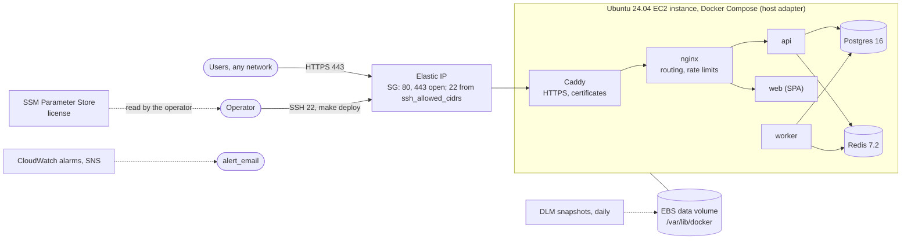

# Margince on AWS, light

One Ubuntu 24.04 EC2 instance in a customer's AWS account.
Terraform creates the infrastructure only. The template's `host` adapter
deploys Margince to the instance: Docker Compose, nginx for routing and per-address rate limits on the
credential endpoints (`AUTH_RATE_LIMIT_PER_MINUTE` in `host.env`, default
30), Caddy with an automatic HTTPS
certificate, and PostgreSQL 16 and Redis as containers on the instance
([docs/deploy.md, Section 5](../../../../docs/deploy.md#5-the-host-adapter)).
The Azure light stack ([../../azure/light](../../azure/light/README.md)) has the
same shape, variables and outputs.

## 1. What it creates

| Area | Resources |
|---|---|
| Compute | One EC2 instance, `t4g.large` (2 vCPU, 8 GiB, Graviton arm64; `architecture = "amd64"` with `t3.large` for x86_64), Canonical Ubuntu 24.04 LTS AMI from SSM. IMDSv2 required. User `ubuntu` with passwordless `sudo`, key pair from `admin_ssh_public_key`. |
| Storage | 30 GB encrypted gp3 root volume. 64 GB encrypted gp3 data volume (`prevent_destroy`), mounted at `/var/lib/docker` by cloud-init before Docker is installed. Every Docker volume (`pgdata`, `redisdata`, `blobs`, `caddydata`) is on it. |
| Network | VPC with one public subnet, Elastic IP. Security group: 80 and 443 from the internet, 22 from `ssh_allowed_cidrs` only. Outbound open. |
| Secrets | SSM Parameter Store SecureString `/<name_prefix>/margince-license` with the license. The instance does not read it. |
| Backup | Data Lifecycle Manager: daily snapshots of the data and the root volume, 7 kept. |
| Alarms | SNS topic and three CloudWatch alarms: system status check with auto-recover, instance status check failed for 5 minutes, CPU over 90% for 15 minutes, to `alert_email`. |

cloud-init does one thing: it formats the data volume when it has no
filesystem, mounts it by UUID with `nofail`, and makes `docker.service`
require the mount. It also bind-mounts `/var/lib/docker/margince-host` at
`/opt/margince`, owned by the SSH user, so the adapter's default `HOST_DIR`
(`/opt/margince/<name>`, with `shared/instance.env` and `shared/data.env`) is
on the data volume too. It does not install Docker or Margince. Keep `HOST_DIR`
unset, or under `/opt/margince`.



## 2. Cost

eu-central-1, on demand, about **USD 73 per month** (about USD 80 with `amd64`):

| Item | USD per month |
|---|---|
| EC2 `t4g.large` | about 56 (`t3.large`: about 63) |
| gp3 volumes, 94 GB | about 9 |
| Elastic IP (public IPv4) | about 4 |
| Snapshots, incremental | about 2 to 5 |
| Alarms, SNS, SSM Standard | less than 1 |

## 3. Prerequisites

| Requirement | Detail |
|---|---|
| AWS permissions | EC2, EBS, VPC, IAM role creation (Data Lifecycle Manager), CloudWatch, SNS and SSM in the account. |
| Tools | Terraform 1.10.0 or later, AWS CLI, `ssh`, `ssh-keyscan`. |
| State | An S3 bucket for the remote state (`backend.hcl.example`). |
| Instance | The instance repository with `make install` done, and the registry settings of [docs/release.md](../../../../docs/release.md#5-repository-settings). |
| License | A production license, or a test environment ([docs/deploy.md, Section 5.8](../../../../docs/deploy.md#58-the-license-check)). |
| Architecture | The release images must exist for `architecture` (`amd64` or `arm64`). `release.yml` builds the repository variable `PLATFORMS`, default `linux/amd64`. For `arm64`, set `PLATFORMS` to `linux/amd64,linux/arm64` first. |

## 4. Deploy

Run the `terraform` commands in `deploy/production/aws/light` and the `make`
commands in the repository root.

### 4.1 Apply

1. Copy `backend.hcl.example` to `backend.hcl` and fill it in.
2. Copy `terraform.tfvars.example` to `terraform.tfvars` and fill in the
   required variables below. Set `license_token` to store the license in
   SSM.

   | Variable | Default | Meaning |
   |---|---|---|
   | `domain` | required | Public host name, for example `crm.example.com`. |
   | `admin_ssh_public_key` | required | ed25519 or RSA public key of the SSH user `ubuntu`. |
   | `ssh_allowed_cidrs` | required | IPv4 ranges for SSH. `0.0.0.0/0` is refused. |
   | `name_prefix` | `margince-light` | Prefix of the resource names. |
   | `region` | `eu-central-1` | AWS region. |
   | `architecture` | `arm64` | `arm64` or `amd64` (Section 8.1). |
   | `instance_type` | `t4g.large` | EC2 instance type of that architecture (`t3.large` for `amd64`). |
   | `data_disk_gb` | `64` | Size of the data volume. |
   | `alert_email` | `""` | Subscriber of the alerts topic. Empty adds none. |
   | `license_token` | `""` | `MARGINCE_LICENSE`, stored in SSM. |

3. Apply:

   ```sh
   terraform init -backend-config=backend.hcl
   terraform apply
   ```

4. Wait until cloud-init has mounted the data volume:

   ```sh
   $(terraform output -raw ssh_command) cloud-init status --wait
   ```

   `status: done` is required. On `status: error`, read
   `/var/log/cloud-init-output.log` on the instance.

### 4.2 DNS

Create the A record that `terraform output dns_record` prints, at your DNS
provider. A CAA record, if present, must allow `letsencrypt.org`.

### 4.3 host.env, config and secrets

1. Replace the `HOST_SSH=` and `HOST_DOMAIN=` lines of
   `deploy/production/host.env` with the output of:

   ```sh
   terraform output -raw host_env
   ```

2. Set `bootstrap_admin.email` and the workspace in
   `deploy/production/config/margince.yaml`.
3. Add every name that `terraform output secret_names` prints to
   `deploy/production/secrets`, one per line.
4. Commit and push. `make deploy` refuses uncommitted changes.

### 4.4 Known hosts

1. Run the commands that `terraform output -raw ssh_known_hosts_hint`
   prints. They read the host key with `ssh-keyscan` and the fingerprints
   from the instance's console output.
2. Compare the ED25519 fingerprints. Continue only when they match.
3. Export `HOST_KNOWN_HOSTS` as the last line of the hint shows.

### 4.5 Install Docker

```sh
make host-bootstrap ENV=production
```

### 4.6 Release and deploy

1. Cut a release and wait until `release.yml` has pushed the images:

   ```sh
   make release VERSION=<v>
   ```

   The images must include this instance's platform, `terraform output -raw
   image_platform`, which is `linux/<architecture>`. `release.yml`
   pushes the platforms in the repository variable `PLATFORMS` (default
   `linux/amd64`); set `PLATFORMS=linux/amd64,linux/arm64` to deploy on either
   ([docs/release.md, Section 5](../../../../docs/release.md#5-repository-settings)).

2. Set the values of `secret_names` from SSM. Run the commands that
   this prints:

   ```sh
   terraform output -raw secret_exports
   ```

3. Deploy. `REGISTRY` must be the value the release used:

   ```sh
   REGISTRY=<registry> make deploy ENV=production VERSION=<v>
   ```

### 4.7 First sign-in

1. Print the generated first admin password:

   ```sh
   make host-admin-password ENV=production
   ```

2. Sign in at `https://<domain>` as `bootstrap_admin.email` and change the
   password.

## 5. Upgrades

An upgrade is a deployment of a new version:

```sh
make release VERSION=<v>
REGISTRY=<registry> make deploy ENV=production VERSION=<v>
```

Rollback and its limits: [docs/deploy.md, Section 5.12](../../../../docs/deploy.md#512-rollback-limits).

A change of `user_data` replaces the instance. The data volume and the
Elastic IP stay. After a replacement:

1. Wait for `cloud-init status --wait` (Section 4.1).
2. Get the new host key into `HOST_KNOWN_HOSTS` (Section 4.4).
3. Run `make host-bootstrap ENV=production`.
4. Run `make deploy ENV=production VERSION=<v>`. The volumes and
   `HOST_DIR` are on the data volume, so the data, the database passwords and
   the generated keys are kept.

## 6. Backups and restore

Data Lifecycle Manager snapshots the data volume
and the root volume daily at 02:00 UTC, selected by the tag
`Backup = <name_prefix>-daily`, and keeps 7. The template itself does not
back up the database ([docs/deploy.md, Section 5.13](../../../../docs/deploy.md#513-backups)).

| Task | Action |
|---|---|
| Restore the data volume | Create a volume from a snapshot in the instance's zone, stop the instance, detach the data volume, attach the restored volume as `/dev/sdf`, start the instance. Then `terraform import` the restored volume into `aws_ebs_volume.data` (after `terraform state rm` of the old one). |
| Keep the instance keys | Also copy `$HOST_DIR/shared/instance.env` off the instance and store it securely. `MARGINCE_KEYVAULT_ROOT_KEY` opens the sealed data; a snapshot without it is not enough. |

A snapshot of a running database is crash-consistent. For an
application-consistent copy, also run `pg_dump` in the `postgres` container on
a schedule.

## 7. Sign-in

Margince uses its own accounts: users sign in with email and password, and an administrator invites them. Nothing in this stack is needed for that.

Microsoft (Entra ID) or Google sign-in is optional. A Margince administrator turns it on in **Settings → General → Microsoft app** (or **Google app**) with an app the customer's IT registers in its own Entra or Google console; no restart and no apply. Register the redirect URIs from `terraform output sso_redirect_uris`. A Microsoft app saved in Settings signs in only users of the directory it is registered in. To allow only single sign-on after that, set `auth.password.enabled: false` in `margince.yaml` (core `docs/reference/configuration.md`, "Turning the password method off"); the operator's emergency route is core's `margince-migrate reset-password`.

Password login is protected by per-client rate limits on the credential endpoints (the host adapter's nginx).

## 8. AWS notes

### 8.1 Architecture

`architecture` (`amd64` or `arm64`) selects the Ubuntu AMI. `instance_type`
must be of that architecture: a Graviton type (`t4g`, `m7g`, `c7gn`, ...) for
`arm64`, any other type for `amd64`; a mismatch fails the plan. The release
images must exist for that architecture (Section 3).

### 8.2 Recovery

The system status alarm runs EC2 auto-recover: the instance moves to healthy
hardware and keeps its ID, Elastic IP and volumes. The instance status alarm
only notifies; reboot the instance.

### 8.3 Access

| Task | Command |
|---|---|
| Shell on the instance | `terraform output -raw ssh_command` |
| Logs | `docker compose -p margince-<name> logs` on the instance, in `$HOST_DIR/current` |
| Console output | `aws ec2 get-console-output --instance-id <id> --latest --output text` |

## 9. Versions

| Component | Version | Source |
|---|---|---|
| Ubuntu | 24.04 LTS | `ec2.tf`, current AMI at create time; later AMIs are ignored |
| Docker Engine, Compose plugin | Docker's apt repository | `make host-bootstrap` |
| PostgreSQL | 16 with pgvector | the image the host adapter pins (`scripts/deploy/host/compose.yaml`) |
| Redis | 7.2 | the image the host adapter pins (`scripts/deploy/host/compose.yaml`) |
| Terraform | 1.10.0 or later | `versions.tf` |
| Providers | aws ~> 5.60 | `versions.tf` |

## 10. Tests

```sh
terraform init -backend=false
terraform validate
terraform test          # offline checks with mocked providers
```
