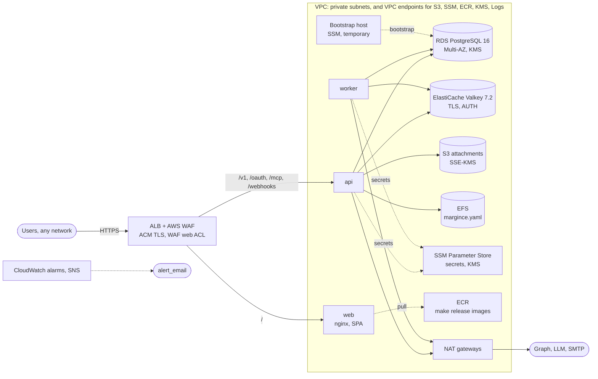

# Margince on AWS

Terraform root module that deploys Margince into your own AWS account, sized
for a small team (about 40 users). It deploys the images that the template's
`make release` builds (Section 3), the same flow as the Azure standard stack.

## What it creates

| Area | Resources |
|---|---|
| Edge | Application Load Balancer: the only public entry. TLS 1.2/1.3 with the ACM certificate `acm_certificate_arn`, HTTP to HTTPS redirect, deletion protection, access logs. AWS WAF web ACL (six AWS managed rule groups, two per-IP rate limits), `waf_mode` count or block. See "WAF rollout". |
| Compute | ECS Fargate cluster: **api** (2 to 4 tasks, CPU autoscaling), **worker** (1 to 3 tasks), **web** (nginx + SPA, 2 tasks). Each has its own security group, task role and least-privilege execution role. |
| Data | RDS PostgreSQL 16 (Multi-AZ, gp3 with storage autoscaling, 7-day backups, deletion protection, Performance Insights), ElastiCache Valkey 7.2 (two nodes, automatic failover, TLS required, AUTH token), S3 attachment bucket (versioned, SSE-KMS enforced), EFS for `margince.yaml` |
| Network | VPC with public and private subnets across `az_count` zones, one NAT gateway per zone, VPC endpoints (S3 gateway; ECR, SSM, KMS and CloudWatch Logs interface endpoints) restricted to this account, VPC flow logs |
| Secrets | SSM Parameter Store SecureStrings under `/<name_prefix>/`, one customer-managed KMS key (rotation on) for everything stored at rest |
| Delivery | ECR repositories `<instance_name>/api|web|worker` (IMMUTABLE tags, enhanced scanning, lifecycle policy), a bootstrap host security group and instance profile |
| Protection | CloudWatch alarms to a CMK-encrypted SNS topic, `prevent_destroy` on the stateful resources, EFS backup, CloudWatch log groups (30 days) |




## Before you start

- **AWS**: an identity that may create VPC, ECS, RDS, ElastiCache, S3, EFS,
  KMS, IAM, WAF, ALB, SSM and CloudWatch resources in the target account.
- **TLS certificate**: an ACM certificate in `aws_region` for the host in
  `public_base_url`, validated in your DNS zone.
- **Tools**: Terraform 1.10 or newer, AWS CLI with the Session Manager
  plugin, `jq`, `psql`; Docker with buildx for a manual image push
  (Section 3).
- **Margince**: a licence token, and this instance repository with its `core/`
  submodule checked out (`git submodule update --init`). The images come from
  `make release`; the bootstrap SQL and `margince.example.yaml` come from
  `core/`.
- **Remote state**: state holds every generated password. Create a protected
  state bucket first (`backend.hcl.example`) and never keep state on a laptop.

## 1. Provision (services off)

```bash
cd deploy/production/aws/standard
cp backend.hcl.example backend.hcl            # fill in
cp terraform.tfvars.example terraform.tfvars  # fill in
terraform init -backend-config=backend.hcl

# Everything the database bootstrap and the image push need, but not the ECS
# services: they would start pointed at a tag ECR does not have yet.
terraform apply \
  -target=aws_ecr_repository.api -target=aws_ecr_repository.worker -target=aws_ecr_repository.web \
  -target=aws_db_instance.this -target=aws_elasticache_replication_group.this \
  -target=aws_s3_bucket.blobstore -target=aws_efs_file_system.config \
  -target=aws_efs_mount_target.config -target=aws_efs_access_point.config \
  -target=aws_ssm_parameter.owner_dsn -target=aws_ssm_parameter.app_dsn -target=aws_ssm_parameter.rds_master_password \
  -target=aws_security_group.ops -target=aws_iam_instance_profile.ops \
  -target=aws_iam_role_policy.ops_efs -target=aws_iam_role_policy_attachment.ops_ssm
```

`terraform.tfvars` needs `public_base_url`, `acm_certificate_arn`,
`release_version`, `license_token` and `admin_bootstrap_password`, and
usually `alert_email`. See "Variables".

## 2. Bootstrap the database (once)

RDS's master user is `dbadmin` (`rds.tf`). RDS has no public IP, and its
security group admits only the api and worker tasks and the bootstrap host
(`ops.tf`). Launch that host once, for steps 2 and 4, and terminate it
afterwards:

```bash
OPS_ID="$(aws ec2 run-instances \
  --image-id resolve:ssm:/aws/service/ami-amazon-linux-latest/al2023-ami-kernel-default-x86_64 \
  --instance-type t3.micro \
  --subnet-id "$(terraform output -json private_subnet_ids | jq -r '.[0]')" \
  --security-group-ids "$(terraform output -raw ops_security_group_id)" \
  --iam-instance-profile Name="$(terraform output -raw ops_instance_profile_name)" \
  --metadata-options HttpTokens=required \
  --query 'Instances[0].InstanceId' --output text)"
aws ec2 wait instance-status-ok --instance-ids "$OPS_ID"
```

Forward local port 5432 to RDS through the host (Session Manager, no SSH),
and leave this running in a second terminal:

```bash
aws ssm start-session --target "$OPS_ID" \
  --document-name AWS-StartPortForwardingSessionToRemoteHost \
  --parameters "host=$(terraform output -raw rds_endpoint),portNumber=5432,localPortNumber=5432"
```

Then run core's bootstrap SQL. The passwords come from SSM Parameter Store,
so your identity needs `ssm:GetParameter` on `/<name_prefix>/*` and
`kms:Decrypt` on `terraform output -raw kms_key_arn`. `hostaddr=127.0.0.1`
sends the connection through the tunnel while `sslmode=verify-full` still
checks the certificate against the RDS host name:

```bash
curl -o /tmp/rds-ca-bundle.pem https://truststore.pki.rds.amazonaws.com/global/global-bundle.pem

ssm_get() { aws ssm get-parameter --with-decryption --name "$(terraform output -json ssm_parameter_names | jq -r ".$1")" --query Parameter.Value --output text; }
OWNER_PW="$(ssm_get owner_dsn | sed -E 's#.*:([^:@]+)@.*#\1#')"
APP_PW="$(ssm_get app_dsn | sed -E 's#.*:([^:@]+)@.*#\1#')"
MASTER_PW="$(ssm_get rds_master_password)"

psql "postgres://dbadmin:${MASTER_PW}@$(terraform output -raw rds_endpoint):5432/margince?hostaddr=127.0.0.1&sslmode=verify-full&sslrootcert=/tmp/rds-ca-bundle.pem" \
  -v owner_pw="$OWNER_PW" -v app_pw="$APP_PW" \
  -f ../../../../core/scripts/deploy/db-bootstrap.sql   # core's SQL, at the pinned core version
```

The master password exists only as the `/<name_prefix>/rds-master-password`
parameter, for this step; no ECS task or execution role can read it.

## 3. Build and push the images

The images are the ones `make release` (the `release.yml` workflow) or
`make package` builds from core's `Dockerfile`, named
`<REGISTRY>/<instance_name>/<role>:<VERSION>` (the instance repository's
`docs/release.md`, Section 6). This stack deploys
`<registry>/<instance_name>/<role>:<release_version>`
(`terraform output image_refs`).

1. Set the image registry. `REGISTRY` is this account's ECR registry host:

   ```sh
   terraform output -raw registry   # <account>.dkr.ecr.<region>.amazonaws.com
   ```

   For `release.yml`, set it as the repository variable `REGISTRY`. For a
   manual push, export it in your shell. `instance_name` must equal `name`
   in `instance.yaml`.

2. Log in to the registry. `release.yml` logs in with the repository
   secrets `REGISTRY_USERNAME` (`AWS`) and `REGISTRY_PASSWORD`. An ECR
   password expires after 12 hours, so refresh it right before each release:

   ```sh
   aws ecr get-login-password --region <aws_region> | gh secret set REGISTRY_PASSWORD
   gh secret set REGISTRY_USERNAME --body AWS
   ```

   For a manual push:

   ```sh
   aws ecr get-login-password --region <aws_region> \
     | docker login --username AWS --password-stdin "$REGISTRY"
   ```

3. Build and push the release, one of:

   ```sh
   make release VERSION=v0.3.0                      # release.yml builds, tests and pushes
   make package VERSION=v0.3.0 && for role in api web worker; do
     docker push "$REGISTRY/<instance_name>/$role:v0.3.0"
   done                                             # manual push
   ```

The identity that pushes needs `ecr:GetAuthorizationToken` on `*`, and
`ecr:BatchCheckLayerAvailability`, `ecr:InitiateLayerUpload`,
`ecr:UploadLayerPart`, `ecr:CompleteLayerUpload`, `ecr:PutImage` and
`ecr:BatchGetImage` on the three repositories, plus `kms:GenerateDataKey`
and `kms:Decrypt` on `kms_key_arn` (the repositories are encrypted with it).
The repositories are `IMMUTABLE`: a pushed tag is never overwritten. The
tasks run `cpu_architecture` (default `X86_64`, what `release.yml` builds by
default); for `ARM64`, set the repository variable
`PLATFORMS = "linux/amd64,linux/arm64"` first.

## 4. Upload `margince.yaml` (once)

On the bootstrap host (`aws ssm start-session --target "$OPS_ID"`). The file
system policy allows only IAM-authorised TLS mounts; the host's instance
profile grants mount and write. Copy `margince.yaml` (from
`core/config/margince.example.yaml`) and the RDS CA bundle to the host first,
then:

```bash
sudo dnf install -y amazon-efs-utils
sudo mkdir -p /mnt/margince-config
sudo mount -t efs -o tls,iam,accesspoint=<efs_config_access_point_id> \
  <efs_file_system_id>:/ /mnt/margince-config
# the ids: terraform output -raw efs_config_access_point_id / efs_file_system_id
sudo cp ./margince.yaml /mnt/margince-config/margince.yaml
# edit: workspace, bootstrap_admin (password_file: secrets/admin-password),
# seeds.ai_routing for your LLM provider
sudo cp ./rds-ca-bundle.pem /mnt/margince-config/rds-ca-bundle.pem   # the DSNs verify RDS against it
sudo umount /mnt/margince-config
```

Terminate the bootstrap host when steps 2 and 4 are done:

```bash
aws ec2 terminate-instances --instance-ids "$OPS_ID"
```

## 5. Start the services

```bash
terraform apply
```

This creates everything else: the ALB with its web ACL, the three ECS
services, the remaining parameters and the alarms. Point `public_base_url`'s
host at `terraform output -raw alb_dns_name` (CNAME or ALIAS record). The api
applies migrations on start and bootstraps the organization from
`MARGINCE_ADMIN_PASSWORD`.

Check the entry point:

```bash
curl -s https://crm.example.com/readyz                                                  # 200 when dependencies are healthy
curl -s -o /dev/null -w '%{http_code}\n' https://crm.example.com/metrics                # not routed to the api
curl -s -o /dev/null -w '%{http_code}\n' http://crm.example.com/                        # 301 to HTTPS
```

## 6. First login

1. Sign in with the bootstrap admin and set the permanent password.
2. Remove `bootstrap_admin` from `margince.yaml` and overwrite the admin
   password parameter with an inert value (`secrets.tf` ignores later changes
   to it, so an apply does not put the bootstrap password back):

   ```bash
   aws ssm put-parameter --overwrite --type SecureString \
     --key-id "$(terraform output -raw kms_key_arn)" \
     --name "$(terraform output -json ssm_parameter_names | jq -r .admin_password)" \
     --value "$(openssl rand -base64 32)"
   ```

3. Confirm the `alert_email` subscription (AWS sends a confirmation mail), or
   subscribe your own endpoint to `terraform output -raw alerts_topic_arn`.

## 7. Releases

Follow Section 3 for each new version, then set `release_version` in
`terraform.tfvars` and run `terraform apply`. All three services get a new
task definition in the same apply; api, worker and web move together.

## Sign-in

Margince uses its own accounts: users sign in with email and password, and an administrator invites them. Nothing in this stack is needed for that.

Microsoft (Entra ID) or Google sign-in is optional. A Margince administrator turns it on in **Settings → General → Microsoft app** (or **Google app**) with an app the customer's IT registers in its own Entra or Google console; no restart and no apply. Register the redirect URIs from `terraform output sso_redirect_uris`. A Microsoft app saved in Settings signs in only users of the directory it is registered in. To allow only single sign-on after that, set `auth.password.enabled: false` in `margince.yaml` (core `docs/reference/configuration.md`, "Turning the password method off"); the operator's emergency route is core's `margince-migrate reset-password`.

Password login is protected by per-client rate limits on the credential endpoints (the WAF's per-IP rate rules).

## WAF rollout

`alb.tf`'s web ACL, the counterpart of the Azure standard stack's WAF policy
with the same rate rules, in priority order: `AmazonIpReputationList`, a
per-IP rate limit of 100 requests per 5 minutes on the credential endpoints
(`/v1/auth/login`, `/v1/auth/forgot-password`, `/v1/auth/reset-password`,
`/oauth/token`, `/oauth/register`), a global per-IP rate limit of 2000 per
5 minutes that excludes `/webhooks/gmail|graph|hubspot` (HMAC-verified
provider traffic from shared provider IPs), `AnonymousIpList` (always
count-only: labels VPN, Tor and hosting traffic in the logs),
`CommonRuleSet` (`SizeRestrictions_BODY` always count), `KnownBadInputsRuleSet`,
`SQLiRuleSet` and `LinuxRuleSet`. Rate-limited requests get HTTP 429. The
rule set uses about 1,405 WCU, inside the 1,500 included in the web ACL price.

`waf_mode` defaults to `"count"`: every rule only counts, nothing is
blocked. Run like that for about a week of real traffic, then review what
would have been blocked (CloudWatch Logs Insights on
`aws-waf-logs-<name_prefix>`):

```
# Which web ACL rules would have blocked (a would-be block is an ALLOW record
# whose nonTerminatingMatchingRules names the rule or rule group):
fields @timestamp, httpRequest.clientIp, httpRequest.uri, nonTerminatingMatchingRules.0.ruleId as rule
| filter ispresent(nonTerminatingMatchingRules.0.ruleId)
| stats count(*) as hits by rule, httpRequest.uri
| sort hits desc

# Which managed rule inside a group matched (awswaf:managed:aws:<group>:<rule>):
fields @timestamp, httpRequest.uri, @message
| parse @message /"labels":\[(?<labels>[^\]]*)\]/
| filter labels like /awswaf:managed:aws/
| stats count(*) as hits by labels, httpRequest.uri
| sort hits desc
```

For every legitimate request that matched, add a `rule_action_override`
(count) for that rule in `local.waf_managed_rule_groups` (rich-text bodies
are a likely `CrossSiteScripting_BODY` candidate), then set
`waf_mode = "block"` and apply. The blocked-requests alarm (above 500 per
5 minutes) reports spikes once blocking.

Logging: every request goes to the CMK-encrypted `aws-waf-logs-<name_prefix>`
group, kept 30 days, with the `authorization` and `cookie` headers and the
query string redacted. In block mode a logging filter keeps only BLOCK,
COUNT and EXCLUDED_AS_COUNT records; plain ALLOW traffic is already in the
ALB access logs.

## Variables

Only what you must set or what genuinely sizes the installation is a
variable (`variables.tf`); everything else is a fixed value in the file that
uses it.

| Variable | Default | Purpose |
|---|---|---|
| `public_base_url` | required | `https://<host>` the ALB serves |
| `acm_certificate_arn` | required | ACM certificate for that host |
| `release_version` | required | Release to deploy (image tag) |
| `license_token` | required | Licence token |
| `admin_bootstrap_password` | required | First-boot admin password |
| `alert_email` | `""` | Alert subscription |
| `aws_region`, `name_prefix`, `instance_name` | `eu-central-1`, `margince`, `margince-default` | Placement and names |
| `az_count` | `2` | Availability Zones (one NAT gateway each) |
| `cpu_architecture` | `X86_64` | Fargate architecture of the images |
| `db_instance_class`, `db_multi_az` | `db.t4g.medium`, `true` | Postgres size and HA |
| `api_min_replicas`, `api_max_replicas` | `2`, `4` | api scale bounds |
| `waf_mode` | `count` | `count` then `block` |

## Redis

ElastiCache runs Valkey 7.2, the Redis 7.2 fork: the same protocol series as
core's `redis:7.2` and the Azure stacks (ElastiCache has no Redis OSS 7.2).
Two nodes with automatic failover, `noeviction` (Redis is the outbox relay:
an evicted key is a lost event), TLS required and an AUTH token, 7-day
snapshots and slow-log delivery to CloudWatch Logs.

## Cost

Rough list prices in eu-central-1, per month, before usage-based traffic:

| Item | USD |
|---|---|
| ECS Fargate: api (2-4 tasks), worker (1-3), web (2) | 80-165 |
| RDS db.t4g.medium Multi-AZ, 50 GB gp3 | 130-145 |
| ElastiCache cache.t4g.small, two nodes | 60 |
| NAT gateways (2) and data processing | 65-90 |
| ALB | 30-45 |
| VPC endpoints (5 interface; the S3 gateway endpoint is free) | 40 |
| AWS WAF | 15-25 |
| CloudWatch logs and alarms, SNS | 10-20 |
| S3, EFS, ECR, KMS key and SSM Standard | 10-20 |
| **Total** | **about 440-660** |

A Graviton release (`cpu_architecture = "ARM64"`, `PLATFORMS` including
`linux/arm64`) cuts the Fargate line by about 20%.

## Security notes

- **Public surface**: the ALB only, behind the WAF. Tasks, RDS, ElastiCache
  and EFS sit in private subnets with no public IP. The ALB drops invalid
  header fields and does not route `/metrics`.
- **Encryption at rest**: one customer-managed KMS key (`kms.tf`, rotation
  on) for RDS, ElastiCache, S3 (SSE-KMS with Bucket Keys, other keys denied),
  EFS, every SSM parameter, the ECR repositories, the SNS topic and the WAF
  log group. The ALB log bucket uses SSE-S3, the only option ELB access
  logging supports.
- **Encryption in transit**: TLS 1.2/1.3 at the ALB, HTTP to HTTPS redirect;
  HTTP from the ALB to the tasks inside the private subnets (`cmd/api`
  serves plain HTTP). RDS refuses plaintext (`rds.force_ssl`) and the DSNs
  use `sslmode=verify-full` against the pinned `rds-ca-rsa2048-g1` CA;
  ElastiCache requires TLS; EFS mounts use TLS; the S3 bucket denies
  non-TLS requests.
- **Network**: one security group per tier. `web` reaches only the VPC
  endpoints and S3 (no path to RDS, ElastiCache, EFS or the internet); the
  data tiers have no egress rules; api and worker egress is in-VPC plus
  443 and SMTP. VPC endpoints accept only this account's principals. VPC
  flow logs record all traffic.
- **IAM**: separate task and execution roles per service, ECS trust policies
  with `aws:SourceAccount`/`aws:SourceArn`, no
  `AmazonECSTaskExecutionRolePolicy`. `web` reads no secrets. The RDS master
  password parameter is readable by no task.
- **Containers**: all Linux capabilities dropped, explicit
  `runtime_platform`, `stopTimeout = 60` for api and worker.
- **Images**: IMMUTABLE ECR tags, so `release_version` pins the deployed
  images; continuous enhanced scanning (Amazon Inspector, metered) for this
  instance's repositories; untagged images expire after 14 days, and the 30
  most recent releases are kept.
- **Sign-in**: the WAF's auth-path rate rule is the one fleet-wide login
  limit; the api's own login limiters are per task.
- **Protection**: RDS and ALB deletion protection; `prevent_destroy` on the
  KMS key, S3 bucket, EFS and ElastiCache; final snapshots with a random
  suffix; EFS in AWS Backup; S3 versioning with 90-day noncurrent expiry.
- **Alarms**: always on, to the CMK-encrypted SNS topic, on ALARM and OK:
  ALB 5xx (over 25 per 5 minutes), unhealthy targets, p95 latency (over 2 s),
  ECS CPU and memory (over 85%), RDS storage, CPU, connections (over 320,
  sized for `db.t4g.medium`: raise it in `alarms.tf` with a larger class) and
  CPU credits, ElastiCache memory, CPU and credits, WAF blocked requests.

## Known limitations

- **Destroying the stack**: remove the `prevent_destroy` guards and RDS/ALB
  deletion protection by hand first; they exist to make that deliberate.
- **Credential rotation**: the DSN parameters and the blobstore IAM user's
  access key have no managed rotation (the app reads DSN strings and a
  static key). Rotate them by hand.
- **Not included**: GuardDuty, Shield Advanced, network ACLs beyond the
  default, multi-region or DR. Each is an account-level or cost decision for
  the operator.
- **Two AZs by default**: `az_count = 3` adds a third NAT gateway; verify it
  in a test account first.
- **Recreating RDS or ElastiCache in the same state**: replace the final
  snapshot suffix with it (`terraform apply -replace=random_id.final_snapshot
  -replace=aws_db_instance.this`, `random_id.redis_final_snapshot` for
  ElastiCache), or the second delete collides with the first snapshot.

## Tests

```bash
cd deploy/production/aws/standard
terraform init -backend=false
terraform validate
terraform test          # offline plan checks with mocked providers (tests/)
```
