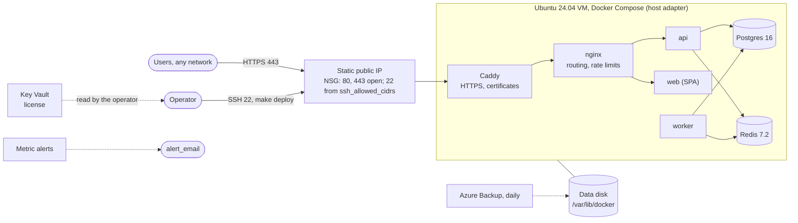

# Margince on Azure, light

One Ubuntu 24.04 VM in a customer's Azure subscription.
Terraform creates the infrastructure only. The template's `host` adapter
deploys Margince to the VM: Docker Compose, nginx for routing and per-address rate limits on the
credential endpoints (`AUTH_RATE_LIMIT_PER_MINUTE` in `host.env`, default
30), Caddy with an automatic HTTPS
certificate, and PostgreSQL 16 and Redis as containers on the VM
([docs/deploy.md, Section 5](../../../../docs/deploy.md#5-the-host-adapter)).
The AWS light stack ([../../aws/light](../../aws/light/README.md)) has the
same shape, variables and outputs.

## 1. What it creates

| Area | Resources |
|---|---|
| Compute | One VM, `Standard_B2ps_v2` (2 vCPU, 8 GiB, Ampere arm64; `architecture = "amd64"` with `Standard_B2ms` for x86_64), Canonical Ubuntu 24.04 LTS server Gen2. Trusted Launch, encryption at host, Azure-orchestrated OS patching. Admin user `azureadmin` with passwordless `sudo`, SSH key login only. |
| Storage | 30 GB OS disk. 64 GB data disk (`prevent_destroy`), mounted at `/var/lib/docker` by cloud-init before Docker is installed. Every Docker volume (`pgdata`, `redisdata`, `blobs`, `caddydata`) is on it. |
| Network | VNet with one subnet, static Standard public IP. NSG: 80 and 443 from the internet, 22 from `ssh_allowed_cidrs` only. Outbound open. |
| Secrets | Key Vault (RBAC, purge protection, firewall open to `ssh_allowed_cidrs` only) with the license. The VM does not read it. |
| Backup | Recovery Services vault: daily backup of the VM with its data disk, 7 days. |
| Alerts | Action group and two metric alerts: VM unavailable for 5 minutes, CPU over 90% for 15 minutes, to `alert_email`. |

cloud-init does one thing: it formats the data disk when it has no
filesystem, mounts it by UUID with `nofail`, and makes `docker.service`
require the mount. It also bind-mounts `/var/lib/docker/margince-host` at
`/opt/margince`, owned by the SSH user, so the adapter's default `HOST_DIR`
(`/opt/margince/<name>`, with `shared/instance.env` and `shared/data.env`) is
on the data disk too. It does not install Docker or Margince. Keep `HOST_DIR`
unset, or under `/opt/margince`.



## 2. Cost

West Europe, pay-as-you-go, about **EUR 65 per month** (about EUR 75 with `amd64`):

| Item | EUR per month |
|---|---|
| VM `Standard_B2ps_v2` | about 45 (`Standard_B2ms`: about 55) |
| OS and data disk (StandardSSD) | about 8 |
| Static public IP | about 3 |
| Azure Backup | about 8 |
| Key Vault, alerts | less than 1 |

## 3. Prerequisites

| Requirement | Detail |
|---|---|
| Azure role | Owner, or Contributor and User Access Administrator, on the subscription. |
| Tools | Terraform 1.10.0 or later, Azure CLI, `ssh`, `ssh-keyscan`. |
| State | A storage account for the remote state (`backend.hcl.example`). |
| Instance | The instance repository with `make install` done, and the registry settings of [docs/release.md](../../../../docs/release.md#5-repository-settings). |
| License | A production license, or a test environment ([docs/deploy.md, Section 5.8](../../../../docs/deploy.md#58-the-license-check)). |

Set the subscription and register encryption at host once; the VM always
uses it:

```sh
export ARM_SUBSCRIPTION_ID="$(az account show --query id -o tsv)"
az feature register --namespace Microsoft.Compute --name EncryptionAtHost
az feature show --namespace Microsoft.Compute --name EncryptionAtHost --query properties.state
az provider register --namespace Microsoft.Compute
```

## 4. Deploy

Run the `terraform` commands in `deploy/production/azure/light` and the `make`
commands in the repository root.

### 4.1 Apply

1. Copy `backend.hcl.example` to `backend.hcl` and fill it in.
2. Copy `terraform.tfvars.example` to `terraform.tfvars` and fill in the
   required variables below. `ssh_allowed_cidrs` must include the address
   you run Terraform from: the Key Vault firewall admits only these
   addresses.

   | Variable | Default | Meaning |
   |---|---|---|
   | `domain` | required | Public host name, for example `crm.example.com`. |
   | `admin_ssh_public_key` | required | ed25519 or RSA public key of the SSH user `azureadmin`. |
   | `ssh_allowed_cidrs` | required | IPv4 ranges for SSH and the Key Vault firewall. `0.0.0.0/0` is refused. |
   | `name_prefix` | `margince` | Prefix of the resource names; the resource group is `<name_prefix>-light`. |
   | `region` | `westeurope` | Azure region. |
   | `architecture` | `arm64` | `arm64` or `amd64`. |
   | `vm_size` | `Standard_B2ps_v2` | VM size of that architecture: an Ampere size for `arm64`, `Standard_B2ms` for `amd64`. A mismatch fails the plan. |
   | `data_disk_gb` | `64` | Size of the data disk. |
   | `alert_email` | `""` | Receiver of the alerts. Empty adds none. |
   | `license_token` | `""` | `MARGINCE_LICENSE`, stored in Key Vault. |

3. Apply:

   ```sh
   terraform init -backend-config=backend.hcl
   terraform apply
   ```

4. Wait until cloud-init has mounted the data disk:

   ```sh
   $(terraform output -raw ssh_command) cloud-init status --wait
   ```

   `status: done` is required. On `status: error`, read
   `/var/log/cloud-init-output.log` on the VM.

### 4.2 DNS

Create the A record that `terraform output dns_record` prints, at your DNS
provider. A CAA record, if present, must allow `letsencrypt.org`.

### 4.3 host.env, config and secrets

1. Replace the `HOST_SSH=` and `HOST_DOMAIN=` lines of
   `deploy/production/host.env` with the output of:

   ```sh
   terraform output -raw host_env
   ```

2. Set `bootstrap_admin.email` and the workspace in
   `deploy/production/config/margince.yaml`.
3. Add every name that `terraform output secret_names` prints to
   `deploy/production/secrets`, one per line.
4. Commit and push. `make deploy` refuses uncommitted changes.

### 4.4 Known hosts

1. Run the commands that `terraform output -raw ssh_known_hosts_hint`
   prints. They read the host key with `ssh-keyscan` and the fingerprints
   from the VM's boot log.
2. Compare the ED25519 fingerprints. Continue only when they match.
3. Export `HOST_KNOWN_HOSTS` as the last line of the hint shows.

### 4.5 Install Docker

```sh
make host-bootstrap ENV=production
```

### 4.6 Release and deploy

1. Cut a release and wait until `release.yml` has pushed the images:

   ```sh
   make release VERSION=<v>
   ```

   The images must include this VM's platform, `terraform output -raw
   image_platform`, which is `linux/<architecture>`. `release.yml`
   pushes the platforms in the repository variable `PLATFORMS` (default
   `linux/amd64`); set `PLATFORMS=linux/amd64,linux/arm64` to deploy on either
   ([docs/release.md, Section 5](../../../../docs/release.md#5-repository-settings)).

2. Set the values of `secret_names` from Key Vault. Run the commands that
   this prints:

   ```sh
   terraform output -raw secret_exports
   ```

3. Deploy. `REGISTRY` must be the value the release used:

   ```sh
   REGISTRY=<registry> make deploy ENV=production VERSION=<v>
   ```

### 4.7 First sign-in

1. Print the generated first admin password:

   ```sh
   make host-admin-password ENV=production
   ```

2. Sign in at `https://<domain>` as `bootstrap_admin.email` and change the
   password.
3. Invite the other users (Section 7).

## 5. Upgrades

An upgrade is a deployment of a new version:

```sh
make release VERSION=<v>
REGISTRY=<registry> make deploy ENV=production VERSION=<v>
```

Rollback and its limits: [docs/deploy.md, Section 5.12](../../../../docs/deploy.md#512-rollback-limits).

A change of the cloud-init document replaces the VM. The data disk and the
public IP stay. After a replacement:

1. Wait for `cloud-init status --wait` (Section 4.1).
2. Get the new host key into `HOST_KNOWN_HOSTS` (Section 4.4).
3. Run `make host-bootstrap ENV=production`.
4. Run `make deploy ENV=production VERSION=<v>`. The volumes and
   `HOST_DIR` are on the data disk, so the data, the database passwords and
   the generated keys are kept.

## 6. Backups and restore

Azure Backup takes a daily recovery point of the
VM with its OS and data disk at 02:00 UTC and keeps 7. The template itself
does not back up the database ([docs/deploy.md, Section 5.13](../../../../docs/deploy.md#513-backups)).

| Task | Action |
|---|---|
| Restore the whole VM | Azure portal: Recovery Services vault `<name_prefix>-rsv` > Backup items > the VM > Restore VM. |
| Restore the data disk only | Restore disks, then swap the data disk of the VM, or attach the restored disk and copy the volumes. |
| Keep the instance keys | Also copy `$HOST_DIR/shared/instance.env` off the VM and store it securely. `MARGINCE_KEYVAULT_ROOT_KEY` opens the sealed data; a backup without it is not enough. |

A disk-level backup of a running database is crash-consistent. For an
application-consistent copy, also run `pg_dump` in the `postgres` container on
a schedule.

## 7. Sign-in

Margince uses its own accounts: users sign in with email and password, and an administrator invites them. Nothing in this stack is needed for that.

Microsoft (Entra ID) or Google sign-in is optional. A Margince administrator turns it on in **Settings → General → Microsoft app** (or **Google app**) with an app the customer's IT registers in its own Entra or Google console; no restart and no apply. Register the redirect URIs from `terraform output sso_redirect_uris`. A Microsoft app saved in Settings signs in only users of the directory it is registered in. To allow only single sign-on after that, set `auth.password.enabled: false` in `margince.yaml` (core `docs/reference/configuration.md`, "Turning the password method off"); the operator's emergency route is core's `margince-migrate reset-password`.

Password login is protected by per-client rate limits on the credential endpoints (the host adapter's nginx).

## 8. Access

| Task | Command |
|---|---|
| Shell on the VM | `terraform output -raw ssh_command` |
| Logs | `docker compose -p margince-<name> logs` on the VM, in `$HOST_DIR/current` |
| Boot log | `az vm boot-diagnostics get-boot-log -g <resource-group> -n <vm>` |

**Arm64.** `architecture = "arm64"` with an Ampere `vm_size` selects the Arm64 Ubuntu image. The VM keeps
Trusted Launch (secure boot, vTPM) and encryption at host; check that the
region offers both for the chosen Arm64 size before the first apply.

## 9. Versions

| Component | Version | Source |
|---|---|---|
| Ubuntu | 24.04 LTS | `vm.tf`, latest image at create time |
| Docker Engine, Compose plugin | Docker's apt repository | `make host-bootstrap` |
| PostgreSQL | 16 with pgvector | the image the host adapter pins (`scripts/deploy/host/compose.yaml`) |
| Redis | 7.2 | the image the host adapter pins (`scripts/deploy/host/compose.yaml`) |
| Terraform | 1.10.0 or later | `versions.tf` |
| Providers | azurerm ~> 4.81, random ~> 3.6 | `versions.tf` |

## 10. Tests

```sh
terraform init -backend=false
terraform validate
terraform test          # offline checks with mocked providers
```
