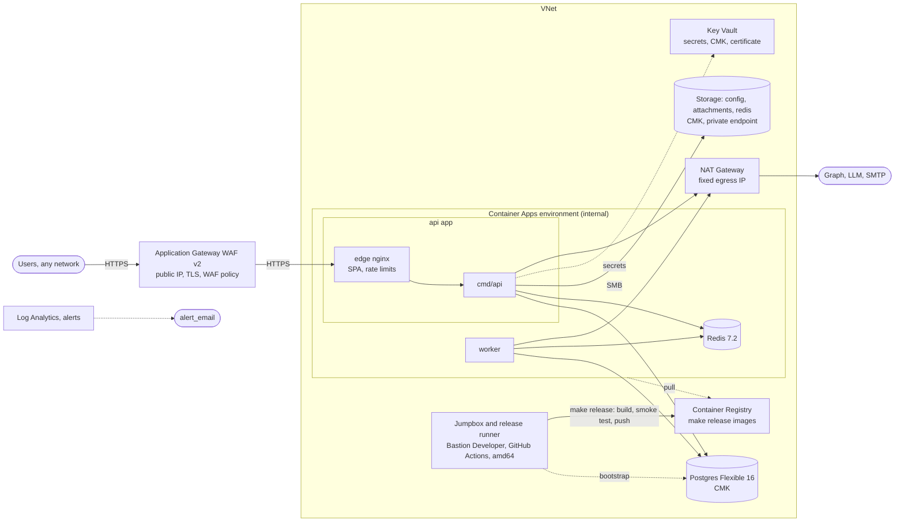

# Margince on Azure

Terraform root module that deploys Margince into your own Azure subscription,
sized for a small team (about 40 users). It deploys the
images that the template's `make release` builds (Section 3), the same flow as
the AWS standard stack.

## What it creates

| Area | Resources |
|---|---|
| Edge | Application Gateway WAF v2 with a static public IP: the only public entry. TLS with the Key Vault certificate `public-tls`, HTTP to HTTPS redirect, WAF policy (Microsoft Default Rule Set 2.1, Bot Manager 1.1, two per-IP rate limits), `waf_mode` count or block. See "WAF rollout". |
| Compute | Container Apps environment (internal: private IP only, workload profiles, Consumption profile, zone-redundant). **api** app (3 to 6 replicas, CPU and HTTP scale rules): `cmd/api` plus an **edge** nginx container that serves the SPA; its ingress is reachable only from the gateway. **worker** app: no ingress. **redis** app: Redis 7.2, one replica, internal TCP only. |
| Data | Postgres Flexible Server 16 (VNet-integrated, customer-managed key, auto-grow, Entra and password auth; single-zone Burstable B2s by default, zone-redundant HA with `db_sku_name` General Purpose and `db_zone_redundant_ha = true`), Storage account with `config`, `attachments` and `redis` file shares, Key Vault premium (RBAC, purge protection) |
| Network | VNet with apps, Postgres, private-endpoint and ops subnets; deny-by-default NSGs; private endpoints and DNS zones for Key Vault, registry, blob and file; NAT Gateway with one fixed egress IP; VNet flow logs with traffic analytics |
| Identity | Managed identities for api, worker, Dataverse and customer-managed keys |
| Delivery | Container Registry Premium (images from `make release`, private endpoint), jumpbox VM with Azure Bastion Developer that is also the self-hosted release runner (managed identity with `AcrPush`) |
| Protection | Share soft delete and daily Azure Backup (attachments, redis), delete locks on the stateful resources, diagnostic settings on every resource that has them, metric alerts, Log Analytics (90 days) |




Staff sign in as described in "Sign-in". Guests reach only their scoped links (booking, Deal Room,
unsubscribe), which the app protects with tokens.

## Before you start

- **Azure**: Owner, or Contributor plus User Access Administrator, on the
  target subscription. `az login --tenant <tenant>`,
  `az account set -s <subscription>`, then
  `export ARM_SUBSCRIPTION_ID=$(az account show --query id -o tsv)`: the
  azurerm 4.x provider requires a subscription ID and this stack does not
  hardcode one.
- **Subscription features, once**: encryption at host for the jumpbox:
  `az feature register --namespace Microsoft.Compute --name EncryptionAtHost`,
  wait until `az feature show` reports `Registered`, then
  `az provider register --namespace Microsoft.Compute`. VNet flow logs need
  Network Watcher in the region (`NetworkWatcher_<region>` in
  `NetworkWatcherRG`), which Azure creates with the first VNet unless the
  subscription opted out.
- **Tools**: Terraform 1.10 or newer, Azure CLI, `jq`. Images are built on
  the jumpbox (Section 3), not on your machine.
- **Margince**: a licence token, and this instance repository with its `core/`
  submodule checked out (`git submodule update --init`). The images come from
  `make release`; the bootstrap SQL and `margince.example.yaml` come from
  `core/`, so every stack deploys the core version `instance.yaml` pins.
- **TLS certificate** for the host in `public_base_url`, as a PFX file, to
  import into Key Vault in step 5.
- **Remote state**: state holds every generated password and key. Create a state storage account first (`backend.hcl.example`)
  and never keep state on a laptop.

## 1. Provision (apps off)

```bash
cd deploy/production/azure/standard
cp backend.hcl.example backend.hcl            # fill in
cp terraform.tfvars.example terraform.tfvars  # fill in
terraform init -backend-config=backend.hcl
terraform apply                               # deploy_apps = false
```

`terraform.tfvars` needs `release_version`, `public_base_url`,
`admin_bootstrap_password`, `license_token` and `jumpbox_ssh_public_key`
(`ssh-keygen -t ed25519`; RSA also works), and usually
`operator_ip_allowlist` (your public IP, from
`curl -s https://api.ipify.org`). See "Variables".

This creates everything except the Container Apps: network, Key Vault and its
secrets, Postgres, the redis app, storage and shares, registry, private
endpoints and the jumpbox. `operator_ip_allowlist` lets Terraform write
Key Vault secrets and file shares from your machine; it is closed in step 6.

## 2. Bootstrap the database (jumpbox, once)

Postgres is reachable only inside the VNet. Open the jumpbox from the Azure
portal (VM `<name_prefix>-jumpbox` → Connect → Bastion → SSH with your private
key), then:

```bash
az login
gh auth login                                 # or read-only deploy keys
git clone --recurse-submodules <instance repository URL> /opt/margince-instance
cd /opt/margince-instance/deploy/production/azure/standard
cp backend.hcl.example backend.hcl            # same values as on your machine
terraform init -backend-config=backend.hcl

scripts/bootstrap-db.sh                       # default SQL: core/scripts/deploy/db-bootstrap.sql
```

`scripts/bootstrap-db.sh` runs core's `scripts/deploy/db-bootstrap.sql` (the
instance repository's `core/` submodule, at the pinned core version) as
`pgadmin` over verified TLS, with the
role passwords passed on stdin rather than the command line. Running the SQL
directly with `psql` fails on Flexible Server: `pgadmin` is not a superuser,
so PostgreSQL refuses `ALTER ROLE ... NOSUPERUSER NOBYPASSRLS`, and on
Postgres 16 `CREATE DATABASE ... OWNER margince_owner` fails with "must be
able to SET ROLE". The wrapper replaces those statements with checks that
only alter a role that actually has the attribute, and grants `pgadmin`
membership in `margince_owner` for the duration of the script. It is safe to
rerun. It creates the `margince` database and the `margince_owner` and
`margince_app` roles. The extensions it needs (`vector`, `unaccent`,
`pg_trgm`, `btree_gist`) are already allow-listed by Terraform. Migrations run
later, from the api's entrypoint, with the owner role.

## 3. Build and push the images

Releases are built inside this stack's network. The jumpbox is also the
repository's self-hosted GitHub Actions runner: `release.yml` builds core's
images on it (`make package`), smoke-tests them (`make smoke`) and pushes them
to the registry with the VM's managed identity, which holds `AcrPush` on this
registry and nothing else. No registry password exists, and the registry
stays private: the jumpbox reaches it through its private endpoint. The
images are named `<REGISTRY>/<instance_name>/<role>:<VERSION>` (the instance
repository's `docs/release.md`, Section 6); this stack deploys
`<registry>/<instance_name>/<role>:<release_version>`
(`terraform output image_refs`).

1. Register the runner, once. In GitHub: repository → Settings → Actions →
   Runners → New self-hosted runner, and copy the registration token. On the
   jumpbox (Bastion, as in step 2), after `cloud-init status --wait` reports
   `done`:

   ```bash
   cd /opt/actions-runner
   sudo -u runner ./config.sh --url https://github.com/<owner>/<repo> --token <token> \
     --labels margince-runner --unattended --replace
   sudo ./svc.sh install runner && sudo ./svc.sh start
   ```

   A jumpbox created before the runner existed has no runner software:
   `terraform apply -replace=azurerm_linux_virtual_machine.jumpbox` first
   (the VM keeps nothing that is not in git).

2. Set the repository variables (Settings → Secrets and variables →
   Actions → Variables):

   | Variable | Value |
   |---|---|
   | `REGISTRY` | `terraform output -raw registry` (`<acr_name>.azurecr.io`) |
   | `RELEASE_RUNNER` | `margince-runner` (`terraform output -raw release_runner_label`) |
   | `PLATFORMS` | leave unset, or `linux/amd64`: Container Apps runs `linux/amd64` images only |

   Leave `REGISTRY_USERNAME` and `REGISTRY_PASSWORD` unset: `release.yml`
   then skips `docker login` and uses the runner's own registry login.
   `instance_name` must equal `name` in `instance.yaml`.

3. Start the jumpbox if it is off (it stops at 20:00; a release waits in
   GitHub's queue until it runs), then release:

   ```sh
   az vm start -g "$(terraform output -raw resource_group_name)" -n "$(terraform output -raw release_runner_vm_name)"
   make release VERSION=v0.3.0      # release.yml builds, smoke-tests and pushes on the runner
   ```

   The registry login refreshes at boot and every hour
   (`margince-acr-login.timer`, `az acr login` tokens last three hours); to
   refresh it by hand: `sudo systemctl start margince-acr-login`.

4. Lock the pushed tags, the counterpart of the AWS stack's `IMMUTABLE`
   repositories, so a release is never overwritten. The runner's identity
   cannot do this; run it as yourself (`az login`) on the jumpbox, then
   `az logout`:

   ```sh
   ACR="$(terraform output -raw acr_name)"
   for role in api web worker; do
     az acr repository update -n "$ACR" --image "<instance_name>/$role:v0.3.0" --write-enabled false
   done
   ```

5. Set `release_version = "v0.3.0"` in `terraform.tfvars` and run
   `terraform apply` (step 5 the first time). api and worker roll together;
   the api startup probe allows five minutes for migrations.

Fallback without GitHub Actions: on the jumpbox as `runner`
(`sudo -iu runner`), clone the instance repository, install the toolchain
`docs/release.md` lists, run `make package VERSION=v0.3.0 REGISTRY=<registry>`
and `docker push` the three images. The timer's login covers the push.

## 4. Upload `margince.yaml` (once)

```bash
ACCOUNT="$(terraform output -raw storage_account_name)"
KEY="$(az storage account keys list --account-name "$ACCOUNT" --query '[0].value' -o tsv)"
cp ../../../../core/config/margince.example.yaml margince.yaml
# edit: workspace, bootstrap_admin (password_file: secrets/admin-password),
# seeds.ai_routing for your LLM provider
az storage file upload --account-name "$ACCOUNT" --account-key "$KEY" \
  --share-name "<name_prefix>-config" --source margince.yaml --path margince.yaml
rm margince.yaml
```

## 5. Start the apps and the gateway

```bash
# DNS, in your zone: an A record for the host in public_base_url
#   crm.example.com  A  $(terraform output -raw public_ip_address)

# The gateway serves the Key Vault certificate public-tls. Import it once, from an operator_ip_allowlist address; renewals
# are new versions of the same certificate, which the gateway picks up within
# four hours without an apply.
az keyvault certificate import --vault-name "$(terraform output -raw key_vault_name)" \
  -n public-tls -f crm.example.com.pfx --password '<pfx password>'

terraform apply -var deploy_apps=true        # then set it in terraform.tfvars
```

The first apply with `deploy_apps = true` creates the Container Apps, the
Application Gateway and its WAF diagnostics. The Container Apps environment
is internal: the api app has no public endpoint, and the gateway reaches it
over the VNet through a private DNS zone for the environment's domain.

Check the entry point:

```bash
curl -s https://crm.example.com/readyz                        # 200 when dependencies are healthy
curl -s -o /dev/null -w '%{http_code}\n' https://crm.example.com/metrics                   # 404
curl -s -o /dev/null -w '%{http_code}\n' http://crm.example.com/                          # 301 to HTTPS
```

## 6. First login, then close setup access

1. Sign in with the bootstrap admin and set the permanent password.
2. Invite staff (see "Sign-in").
3. Remove `bootstrap_admin` from `margince.yaml`, set
   `include_bootstrap_admin = false`, add the LLM provider key in
   Settings → AI.
4. Set `operator_ip_allowlist = []` and apply. From now on, run Terraform
   from the jumpbox (`/opt/margince-instance/deploy/production/azure/standard`, backend as in step 2),
   or add your IP back for a single apply.

## 7. Releases

Follow Section 3 for each new version: start the jumpbox,
`make release VERSION=<v>`, lock the tags, set `release_version` and run
`terraform apply` from the jumpbox or an allowlisted machine.

## Sign-in

Margince uses its own accounts: users sign in with email and password, and an administrator invites them. Nothing in this stack is needed for that.

Microsoft (Entra ID) or Google sign-in is optional. A Margince administrator turns it on in **Settings → General → Microsoft app** (or **Google app**) with an app the customer's IT registers in its own Entra or Google console; no restart and no apply. Register the redirect URIs from `terraform output sso_redirect_uris`. A Microsoft app saved in Settings signs in only users of the directory it is registered in. To allow only single sign-on after that, set `auth.password.enabled: false` in `margince.yaml` (core `docs/reference/configuration.md`, "Turning the password method off"); the operator's emergency route is core's `margince-migrate reset-password`.

Password login is protected by per-client rate limits on the credential endpoints (the edge nginx and the Application Gateway WAF).

## WAF rollout

`appgw.tf`'s WAF policy, the counterpart of the AWS standard stack's web ACL
with the same rules: a per-IP rate limit of 100 requests per 5 minutes on the
credential endpoints (`/v1/auth/login`, `/v1/auth/forgot-password`,
`/v1/auth/reset-password`, `/oauth/token`, `/oauth/register`), a global
per-IP rate limit of 2000 per 5 minutes that excludes
`/webhooks/gmail|graph|hubspot` (HMAC-verified provider traffic from shared
provider IPs), then the managed rule sets Microsoft Default Rule Set 2.1
(OWASP-based) and Bot Manager 1.1, always on. Request bodies are inspected up to 2000 KB;
file uploads are allowed up to 50 MB.

`waf_mode` defaults to `"count"`: the policy runs in Detection mode and the
custom rules only log. Run like that for about a week of real traffic, then
review what would have been blocked (Log Analytics):

```kusto
AGWFirewallLogs
| where TimeGenerated > ago(7d)
| where Action in ("Matched", "Detected", "Blocked")
| summarize hits = count() by RuleId, Message, RequestUri
| order by hits desc
```

Add an exclusion or a rule override in `appgw.tf` for each false positive
(the commented example there), then set `waf_mode = "block"` (Prevention
mode, custom rules block) and apply. The blocked-requests alert
(`alarms.tf`, above 500 blocked requests per 5 minutes) reports spikes once
blocking. Diagnostics send the firewall and access logs to Log Analytics,
kept 30 days, with authorization and cookie headers, cookies and argument
values scrubbed.

## Variables

Only what you must set or what genuinely sizes the installation is a
variable (`variables.tf`); everything else is a fixed value in the file that
uses it.

| Variable | Default | Purpose |
|---|---|---|
| `public_base_url` | required | `https://<host>` the gateway serves |
| `release_version` | required | Release to deploy (image tag) |
| `license_token` | required | Licence token |
| `admin_bootstrap_password` | required | First-boot admin password |
| `jumpbox_ssh_public_key` | required | SSH key for the jumpbox |
| `deploy_apps` | `false` | Two-phase apply: `true` once prerequisites exist (step 5) |
| `operator_ip_allowlist` | `[]` | Setup IPs through the Key Vault, Storage and registry firewalls |
| `key_vault_admin_principal_ids` | `[]` (the applying identity) | Key Vault Administrators |
| `alert_email` | `""` | Alert receiver |
| `include_bootstrap_admin` | `true` | `false` after the first admin login (step 6) |
| `azure_region`, `name_prefix`, `instance_name` | `westeurope`, `margince`, `margince-default` | Placement and names (`name_prefix` is also the resource group) |
| `db_sku_name`, `db_zone_redundant_ha` | `B_Standard_B2s`, `false` | Postgres size and HA |
| `api_min_replicas`, `api_max_replicas` | `3`, `6` | api scale bounds |
| `waf_mode` | `count` | `count` then `block` |
| `architecture` | `amd64` | `amd64` only: Azure Container Apps runs `linux/amd64` images. For arm64 on Azure, use the light stack with an Ampere VM |
| `enable_resource_locks` | `true` | `false` and apply before `terraform destroy` |

## Dataverse (optional)

- Power Platform admin center → environment → Settings → Application users →
  New app user, using `terraform output -raw dataverse_identity_client_id`,
  with a security role limited to the tables Margince syncs. Application
  users need no licence.
- Managed Environments: add `terraform output -raw nat_egress_ip` to the
  Dataverse IP firewall. The jumpbox shares this address.
- Margince's Dynamics overlay adapter is not built yet; the identity,
  egress IP and `/webhooks/*` route are ready for it.

## Redis

Core pins Redis 7.2 (`redis:7.2@sha256:6461…` in its `docker-compose.dev.yml`).
Azure Cache for Redis Basic and Standard offer only Redis 6 (and retire on
30 September 2028), so the stack runs that exact image, as a
single-replica container app: internal TCP ingress on 6379, password from Key
Vault, `noeviction` with a `maxmemory` cap, AOF every second on the `redis`
Azure Files share (soft delete and daily backup). AOF on an SMB share is fine
at this scale. For heavier load, or if Margince accepts Redis 7.4, move to
Azure Managed Redis (`azurerm_managed_redis` in azurerm 4.x).

## Cost

Rough list prices in West Europe, per month, before usage-based traffic:

| Item | EUR |
|---|---|
| Application Gateway WAF v2 (fixed charge, autoscale 1 to 10 units) | 250-350 |
| Container Apps: api (3 replicas), worker, redis | 170-260 |
| Postgres B_Standard_B2s, 64 GiB, backups | 65 |
| Container Registry Premium | 45 |
| NAT Gateway and IP | 35 |
| Private endpoints (4) | 30 |
| Log Analytics, flow logs, traffic analytics | 30-50 |
| Storage (ZRS), Backup, Key Vault | 25-35 |
| Jumpbox and release runner, Standard_B2ms (runs on demand, stops at 20:00), Bastion Developer (free) | 10-25 |
| **Total** | **about 660-895** |

Microsoft recommends General Purpose for production Postgres:
`db_sku_name = "GP_Standard_D2ds_v5"` adds about EUR 75, and
`db_zone_redundant_ha = true` on top adds about EUR 140.

## Security notes

- **Public surface**: the Application Gateway only (WAF v2). The api app's
  ingress is private, in the internal environment. `cmd/api` is reached on localhost; the worker, Redis (internal
  TCP ingress), Postgres, Key Vault, storage and registry have no public
  endpoint once `operator_ip_allowlist` is empty.
- **Sign-in**: password login is open from any address (see "Sign-in"); the
  client address comes from the rightmost `X-Forwarded-For` entry, which the
  gateway and Container Apps append, so clients cannot spoof it. Core keys its
  own per-address limits (login, password reset, single sign-on) on the
  direct peer and reads no forwarded header; behind the edge every request
  comes from `127.0.0.1`, so those limits act as one cap shared by all users.
  The per-client limits are the edge's `limit_req` on the sign-in paths and
  the gateway's WAF rate rules. The edge passes the client address as
  `X-Real-IP` for the api's logs only.
- **Secrets**: each app identity may read only the Key Vault secrets its
  process uses. The api app's identities are also available to its edge
  container; keep the web image current.
- **Encryption**: customer-managed key for Postgres and storage, always on
  (verify in a test subscription that both reach the firewalled vault). The
  registry, which holds only images, uses Microsoft-managed keys. Redis data
  sits on the storage account's `redis` share, under the same key. TLS
  everywhere except the password-protected Redis connection, which never
  leaves the environment.
- **Postgres**: TLS 1.2 minimum, connection throttling after failed logins,
  Entra authentication alongside passwords. Add an Entra administrator in
  the portal (Authentication) if you want one.
- **Logs**: nginx logs paths without query strings and redacts capability
  tokens in public links. Key Vault, blob and file audit logs, NSG events,
  registry logins and backup jobs go to Log Analytics; VNet flow logs go to
  the storage account for 90 days.
- **Jumpbox**: Trusted Launch (secure boot, vTPM), encryption at host,
  platform-managed OS patching, boot diagnostics.
- **Release runner**: use a self-hosted runner with private repositories
  only: on a public repository, a fork's pull request could run code on the
  jumpbox. Jobs run as `runner`, which is in the `docker` group and so
  root-equivalent on the VM: only `release.yml` should use the
  `margince-runner` label, and `az logout` after your own work on the
  jumpbox. The VM's identity holds `AcrPush` on this registry only. The runner
  package is pinned and SHA-256 checked (`jumpbox.tf`,
  `local.release_runner`) and updates itself after registration.
- **Locks**: `CanNotDelete` locks on Postgres, storage, Key Vault, the
  Recovery Services vault and the registry (`enable_resource_locks`). Set it
  to `false` and apply before `terraform destroy`.
- **Images**: `make release` images, released tags locked read-only after
  the push (Section 3), so `release_version` pins the deployed images. Limit
  who can run commands on the jumpbox VM.
- **Storage key**: Azure Files SMB mounts need the account key, which is in
  state and in the environment's storage configuration. Rotate it with the
  secondary key on a schedule.

## Known limitations

- **Attachments on Azure Files.** Margince stores attachments with its
  filesystem store on the `attachments` share until a native Azure Blob
  adapter exists. Upload and read back one attachment after the first
  deploy.
- **nginx config is a copy.** `templates/edge-nginx.conf.tftpl`
  replaces the web image's `frontend/nginx.conf` (core); keep
  their SPA locations in step.
- **Content-Security-Policy is report-only** until the SPA has been checked
  against it.
- **Redis is one container.** It is not zone-redundant. Container Apps starts
  a new revision before stopping the old one, so an in-place change to the
  redis app (image, resources, command) would briefly run two Redis processes
  on the same `/data` and can corrupt its append-only file. The redis app
  therefore ignores changes to its template: a plain `terraform apply` leaves
  it alone. To change its image or sizing (`redis.tf`), replace the app, which stops the old Redis before the new one starts (api
  and worker reconnect once Redis is back):

  ```bash
  terraform apply -replace=azurerm_container_app.redis
  ```
- **Needs app changes**: Entra-only Postgres (no passwords) and Redis with
  Entra auth (Azure Managed Redis) both require support in Margince first.
- **No SMB protocol restrictions** on the file shares: Microsoft does not
  document Container Apps mounts with SMB 3.1.1-only, AES-256-GCM and
  NTLMv2. The shares are reached only through the private endpoint.
- **PgBouncer is off.** Flexible Server's built-in PgBouncer (port 6432) is
  optional; enable it only after checking the app's prepared statements work
  through it in transaction mode.

## Tests

```bash
cd deploy/production/azure/standard
terraform init -backend=false
terraform validate
terraform test          # offline plan checks with mocked providers (tests/)
```
